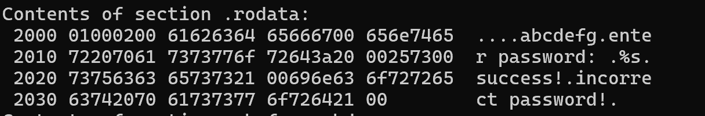
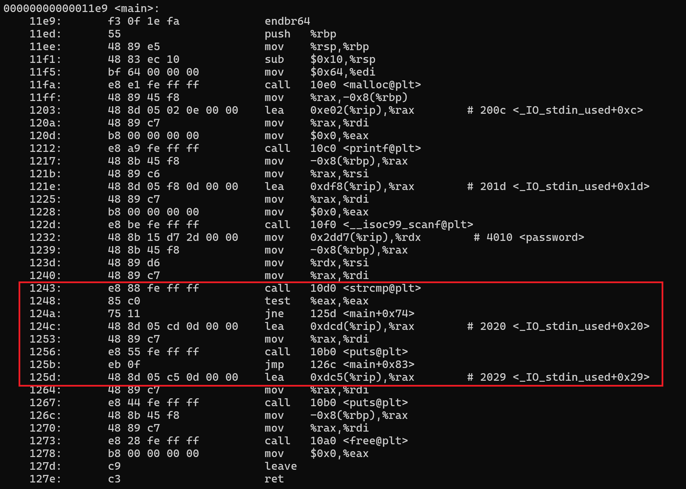
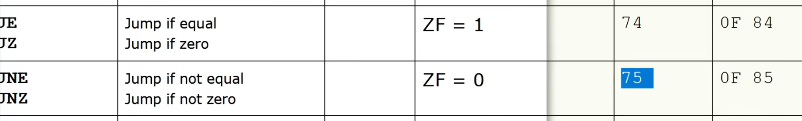
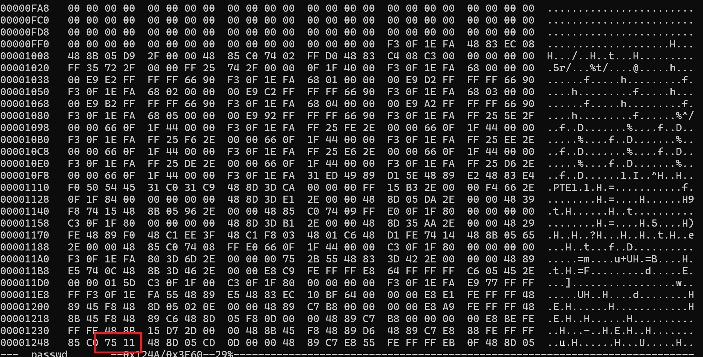
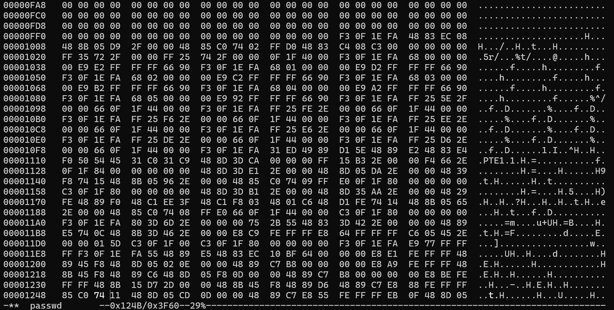
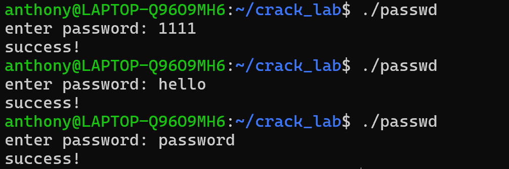

# 一个破解程序的基本原理

最近刷到的一个破解程序方法讲解视频，觉得很有趣，决定记录下来。

假设我们有这样一段代码

```c
#include <stdio.h>
#include <stdlib.h>
#include <string.h>

const char *password = "abcdefg";

int main() {
    char *pwd = (char *)malloc(100);
    printf("enter password: ");
    scanf("%s", pwd);
    if (strcmp(pwd, password) == 0) {
        printf("success!\n");
    } else {
        printf("incorrect password!\n");
    }
    free(pwd);
    return 0;
}
```

最优雅的方法是使用逆向工程获取密码，对于已编译的文件passwd，使用命令输出二进制文件段内容转储结果：

```bash
objdump -s passwd
```

找到包含.rodata字段的部分，即可看到密码“abcdefg”



但这只是一个最基本的情况，因为这个程序中的密码是直接写在内存中的，而且实际上的密码可能伪装成类似十六进制的字段，这样就很难直接通过这个方法找到密码了。

另一个方法，则是不需要破解密码，我们可以直接绕过密码检测。

输入命令反汇编程序：

```bash
objdump -d passwd
```

找到表示main函数的部分：



我们的目标是找到用于密码判断的逻辑部分并对其做出修改，比如类似if-else的跳转语句。

假设我们并不熟悉汇编语法。注意到，在内存1243处发现了用于比较的关键字<strcmp>，紧接着是124a处的jne，根据基本的汇编知识，我们知道这是一个用于跳转的命令。当然也可以继续进行验证，发现它跳转到125d，下面的1267处调用了puts方法，与未发生跳转的1256处对应，可以推测是用于输出结果语句。

既然已经锁定了位置，接下来就可以进行修改。jne命令为不相等时跳转，如果我们将其改为相等时跳转，那么当我们任意输入一个错误的密码，则会被程序判定为正确。



输入命令打开十六进制编辑器：
```bash
hexedit passwd
```
如果是第一次使用需要手动安装：
```bash
sudo apt install hexedit
```

注意之前查看的汇编代码，记下表示jne命令的地址，本次示例中为124a，在hexedit编辑器中按下Enter可以快速查照地址，讲jne的操作码改为表示不相等时跳转的je命令的操作码74，ctrl+x保存。





此外直接把跳转指令替换为 NOP（90，无操作），也可以跳过检查。

再次运行代码，发现输入任意密码都能输出success,成功绕过了密码检测。


[参考资料](https://youtu.be/FkEh4B5CKfI?si=E6b-tW_3MNO_qP4w)
